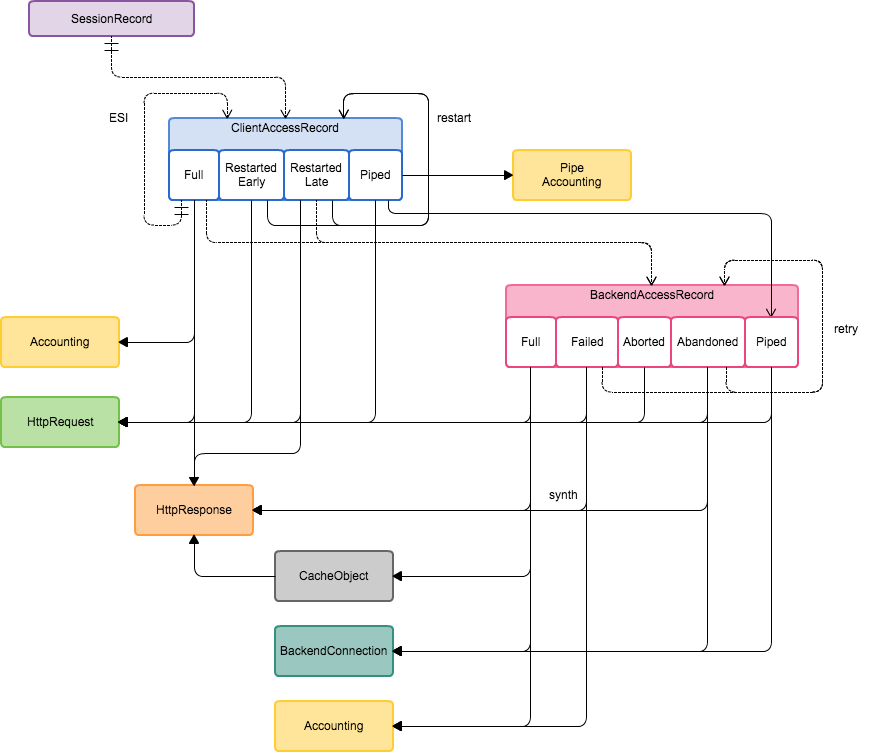

# Varnishslog &emsp; [](https://crates.io/crates/varnishslog)

**`varnishslog` reads Varnish Cache VSL (binary) log stream and produces structured log records in JSON format.**

---

`varnishslog` reads Varnish VSL (binary) log stream and builds a model of access session:



This data is then flattened down and serialised as JSON like this one:

```json
{
  "record_type": "client_request",
  "vxid": 32802,
  "remote_address": {
    "ip": "127.0.0.1",
    "port": 38650
  },
  "session_timestamp": 1476361595.724506,
  "start_timestamp": 1476361595.724543,
  "end_timestamp": 1476361595.869836,
  "handling": "miss",
  "request": {
    "protocol": "HTTP/1.1",
    "method": "GET",
    "url": "/",
    "headers": {
      "User-Agent": [
        "curl/7.40.0"
      ],
      "Accept": [
        "*/*"
      ],
      "Host": [
        "foo.net"
      ],
      "X-Forwarded-For": [
        "127.0.0.1"
      ]
    }
  },
  "response": {
    "status": 200,
    "reason": "OK",
    "protocol": "HTTP/1.1",
    "headers": {
      "Content-Type": [
        "text/html; charset=utf-8"
      ],
      "Date": [
        "Thu, 13 Oct 2016 12:26:35 GMT"
      ],
      "Etag": [
        "W/\"57973331\""
      ],
      "Vary": [
        "Accept-Encoding, Cookie, User-Agent"
      ],
      "Cache-Control": [
        "no-cache"
      ],
      "Accept-Ranges": [
        "bytes"
      ],
      "Transfer-Encoding": [
        "chunked"
      ],
      "Connection": [
        "keep-alive"
      ]
    }
  },
  "backend_access": {
    "vxid": 32803,
    "start_timestamp": 1476361595.724695,
    "end_timestamp": 1476361595.869323,
    "handling": "fetch",
    "request": {
      "protocol": "HTTP/1.1",
      "method": "GET",
      "url": "/",
      "headers": {
        "User-Agent": [
          "curl/7.40.0"
        ],
        "Accept": [
          "*/*"
        ],
        "Host": [
          "foo.net"
        ],
        "Accept-Encoding": [
          "gzip"
        ]
      }
    },
    "response": {
      "status": 200,
      "reason": "OK",
      "protocol": "HTTP/1.1",
      "headers": {
        "Cache-Control": [
          "private, must-revalidate, s-maxage=3644"
        ],
        "Content-Type": [
          "text/html; charset=utf-8"
        ],
        "Vary": [
          "X-Accept-Encoding"
        ],
        "Content-Encoding": [
          "gzip"
        ],
        "Etag": [
          "\"57973331\""
        ],
        "Content-Length": [
          "183806"
        ],
        "Accept-Ranges": [
          "bytes"
        ],
        "Date": [
          "Thu, 13 Oct 2016 12:26:35 GMT"
        ],
        "Age": [
          "0"
        ],
        "Connection": [
          "keep-alive"
        ],
        "Via": [
          "1.1 varnish (Varnish)"
        ]
      }
    },
    "send_duration": 0.000744,
    "wait_duration": 0.138199,
    "ttfb_duration": 0.138943,
    "fetch_duration": 0.144628,
    "sent_header_bytes": 539,
    "sent_body_bytes": 0,
    "sent_total_bytes": 539,
    "recv_header_bytes": 509,
    "recv_body_bytes": 183806,
    "recv_total_bytes": 184315,
    "retry": 0,
    "backend_connection": {
      "fd": 30,
      "name": "boot.origin_primary",
      "remote_address": {
        "ip": "10.1.1.333",
        "port": 80
      },
      "local_address": {
        "ip": "10.1.1.222",
        "port": 53964
      }
    },
    "cache_object": {
      "storage_type": "file",
      "storage_name": "s0",
      "ttl_duration": 3644.0,
      "grace_duration": 259200.0,
      "keep_duration": 0.0,
      "since_timestamp": 1476361596.0,
      "origin_timestamp": 1476361596.0,
      "fetch_mode": "length",
      "fetch_streamed": true,
      "response": {
        "status": 200,
        "reason": "OK",
        "protocol": "HTTP/1.1",
        "headers": {
          "Cache-Control": [
            "private, must-revalidate, s-maxage=3644"
          ],
          "Content-Type": [
            "text/html; charset=utf-8"
          ],
          "Vary": [
            "Accept-Encoding"
          ],
          "Content-Encoding": [
            "gzip"
          ],
          "Etag": [
            "\"57973331\""
          ],
          "Content-Length": [
            "183806"
          ],
          "Date": [
            "Thu, 13 Oct 2016 12:26:35 GMT"
          ],
          "Via": [
            "1.1 varnish (Varnish)"
          ]
        }
      }
    },
    "compression": {
      "operation": "Gunzip-test",
      "bytes_in": 183806,
      "bytes_out": 489611
    },
    "log": {
      "vars": {
        "decision": "Cacheable",
        "esi_parsed": "false",
        "compressable": "false",
        "cache_class": "Cache-Control"
      },
      "messages": [],
      "acl_matched": [],
      "acl_not_matched": []
    }
  },
  "process_duration": 0.0,
  "fetch_duration": 0.139311,
  "ttfb_duration": 0.139434,
  "serve_duration": 0.145293,
  "recv_header_bytes": 106,
  "recv_body_bytes": 0,
  "recv_total_bytes": 106,
  "sent_header_bytes": 283,
  "sent_body_bytes": 489611,
  "sent_total_bytes": 489894,
  "esi_count": 0,
  "compression": {
    "operation": "Gunzip",
    "bytes_in": 183806,
    "bytes_out": 489611
  },
  "restart_count": 0,
  "log": {
    "vars": {
      "client_device": "D",
      "client_country": "Unknown",
      "request_id": "rid-32802",
    },
    "messages": [
      "geoip2.lookup: No entry for this IP address (127.0.0.1)",
      "RES_MODE 48"
    ],
    "acl_matched": [
      "trusted_networks",
      "unthrottled_clients"
    ],
    "acl_not_matched": [
      "forbidden_clients"
    ]
  }
}
```

It can also prepend it with NCSA like log line to make it more compatible with standard access log processing tools.

Compatibility
----

`varnishlog` v0.4.x and earlier was tested with Varnish v4.1.3.
`varnishlog` v0.5.x was tested with Varnish v5.2.1.
`varnishlog` will NOT work with Varnish v3 as there are significant differences in the VSL comparing to v4. I have no plans to support v3 as it is now discontinued.

Usage
-----

`varnishlog -g raw -w /dev/stdout | varnishslog > access.log`

There are few output options and control over indexing of headers and log messages:

```
Varnish Structured Logger 0.4.0
Jakub Pastuszek <jpastuszek@gmail.com>
Reads Varnish VSL (binary) log stream and emits JSON log entries to standard output

USAGE:
    varnishslog [FLAGS] [OPTIONS] [<VSL_FILE>]

FLAGS:
    -h, --help                  Prints help information
    -I, --keep-raw-headers      Keep raw header name/value pairs; any indices are moved to top level
    -L, --keep-raw-log          Include raw log messages
    -i, --no-header-indexing    Do not make indices of request and response headers with normalized header names
    -l, --no-log-processing     Do not process VSL log into vars, messages and ACL matches
    -V, --version               Prints version information

OPTIONS:
    -d, --log-sepc <LOG_LEVEL_SPEC>                    Logging level specification, e.g: info [default: info]
    -o, --output-format <output>                       Format of the output [default: NcsaJson]  [values: Log, LogDebug,
                                                       RecordDebug, SessionDebug, Json, JsonPretty, NcsaJson]
    -s, --stat-epoch-interval <stat-epoch-interval>
            Log store stats every epoch interval (~seconds) on record insert [default: 600]
        --evict-factor <evict-factor>
            Remove that many records at a time when doing expiration or nucking (ratio to max-record-slots) [default: 0.01]
        --max-epoch-diff <max-epoch-diff>
            Consider record being built or correlated as stale after that many epoch (~seconds) elapsed [default: 14410]
        --max-record-slots <max-record-slots>
            Maximum number of records being built or correlated at the same time [default: 4000]
        --stream-buffer-size <stream-buffer-size>
            Size of stream buffer in bytes - must be bigger than biggest VSL record [default: 262144]

ARGS:
    <VSL_FILE>    VSL file to process (read from standard input if not specified)
```

Bench results
-------------

Run against v0.4.1 using 13480 VSL records making up 211 access records and 86 sessions and 86 client access records so about 157 VSL records per output client access record (benches/varnish20160816-4093-1xh1jbx808a493d5e74216e5.vsl).
This was run on MacBook Air (13-inch, Mid 2013) and build with rustc 1.14.0.

```
test log_session_record_ncsa_json ... bench:  14,940,553 ns/iter (+/- 4,323,366)
test log_session_record_json      ... bench:  15,029,912 ns/iter (+/- 3,922,717)
test log_session_record_json_raw  ... bench:   7,898,497 ns/iter (+/- 1,309,983)
test session_state                ... bench:   4,832,503 ns/iter (+/- 1,322,579)
test default_buffer_from_file     ... bench:     323,345 ns/iter (+/- 366,780)
```

* 5.8 K/s JSON records (indexed) or 902 K/s VSL records processed into serialized output
* 10.9 K/s JSON records (raw) or 1668 K/s VSL records processed into serialized output
* 17.8 K/s session records (correlated access records) or 2789 K/s VSL records processed (without serialization)
* 41.6 M/s VSL records extracted from binary stream (message not parsed)
